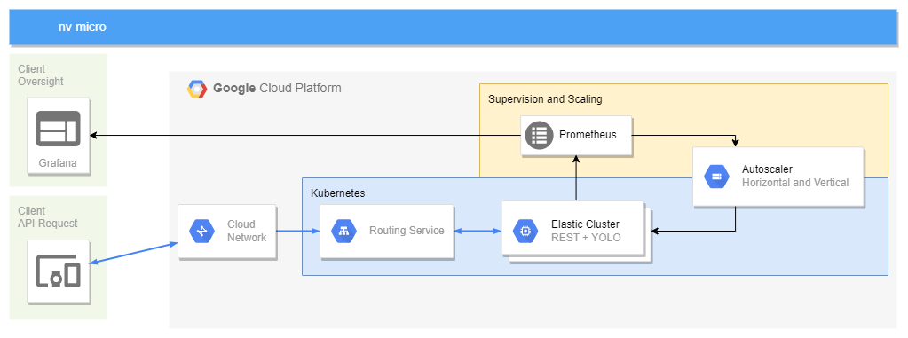
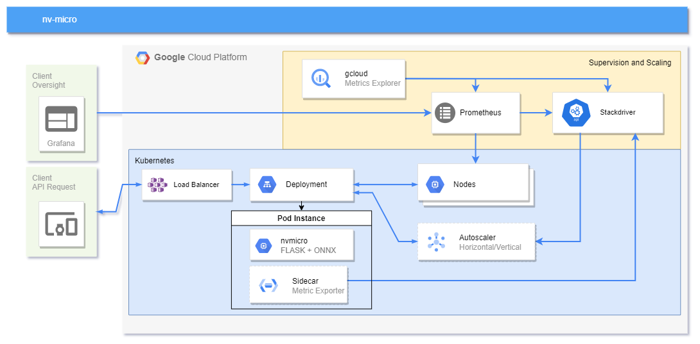

# nv-micro
Microservice architecture (Kubernetes) for a service that determines the eye state of a human in night vision images. 

Project Type A: Architectural Design Prototype -> requires a working live demonstration

## Description
The goal is to provide a REST service that accepts nightvision images (of human faces) and returns a classification for that image with 3 possible output classes (eyes open, eyes closed, no eyes) and use kubernetes to scale the service using horizontal and vertical pod autoscalers. The Classification itself will be driven by a pretrained YOLOv5 model. Prometheus will be used for monitoring and the corresponding visualisations will be done using grafana. A special focus will lie on the horizontal as well as the vertical autoscaler provided by the GCS-Platform.

## Proposal
1. A REST service is implemented that utilizes the already existing YOLO-model.
2. Service is containerized.
3. Kubernetes is set up.
4. Vertical and horizontal auto scalers are set up in the kubernetes cluster.
5. Prometheus is set up in the kubernetes cluster.
6. Grafana dashboard is set up and visualizes the CPU load per pod and the amount of pods.
7. Preparation for live demo is done.

## Architecture


## Goal
The goal is to observe scaling behaviour when the service is put under heavy load and other test scenarios. 
The final presentation will include a live demo with visualization of the cluster for different scenarios.

# How to get started:
1. Create a new GKE-Cluster [here](https://cloud.google.com/kubernetes-engine?hl=en)
2. Navigate to the gcloud [monitoring api](https://console.cloud.google.com/monitoring) and enable Managed Service for Prometheus for your cluster 
3. Configure a node exporter:
4. Open a terminal (make sure you have gcloud cli and its kubectl package installed) 
5. Navigate to the manifests folder in this repository and execute
    ```
    kubectl apply -f nodeexporter.yaml
    ```    
6. Apply the nvmicro deployment to the cluster
    ```
    kubectl apply -f deployment.yaml
    ```
7. Apply the Load Balancer service to the cluster
    ```
    kubectl apply -f loadbalancer.yaml
    ```
8. Apply Stackdriver Adapter manifest to make custom metrics available for the Horizontal Pod Autoscaler

    ```
    kubectl apply -f https://raw.githubusercontent.com/GoogleCloudPlatform/k8s-stackdriver/master/custom-metrics-stackdriver-adapter/deploy/production/adapter_new_resource_model.yaml
    ```
9. Configure the Horizontal Pod Autoscaler
    ```
    kubectl apply -f hpa.yaml
    ```
10. Verify that the Autoscaler is infact running and able to read the custom metrics
    ```
    kubectl describe hpa hpa-nvmicro
    ```
    > It is possible that directly after starting the hpa the console will throw a warning stating that the metrics couldnt be read, the message should disapper after a few seconds.
11. Enable Vertical Pod Autoscaling for the cluster 
    ```
    gcloud container clusters update CLUSTER_NAME --enable-vertical-pod-autoscaling
    ```
    > Note: This will restart the control plane of the specified cluster and may take a few minutes
12. Create an actual Vertical Pod Autoscaler
    ```
    kubectl create -f vpa.yaml
    ```

# Solution

## Overview


## Research
* The entirety of the glcoud documentation 

## Lessons learned
* Gcloud is complex
* Making the various services work together can be challenging
* Trial and error in the cloud is very time intensive
* Finding errors often is frustrating
* Everything sounds easy in the tutorials but reality might look different
* Blindly following tutorials won't work out in most cases
