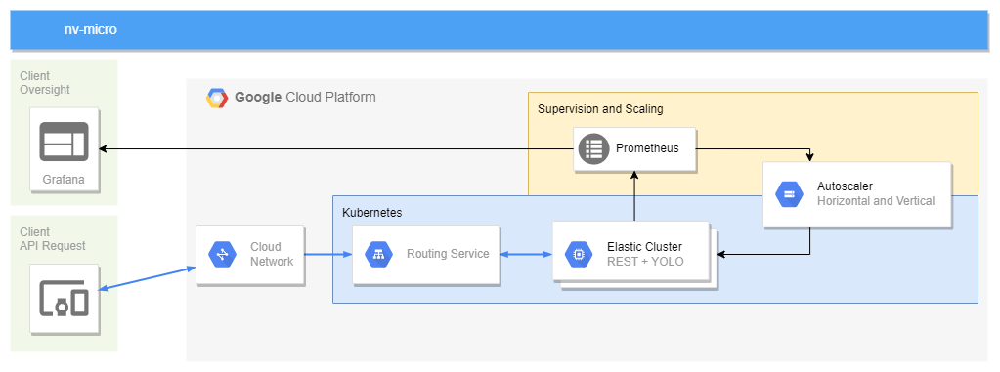

# nv-micro
Microservice architecture (Kubernetes) for a service that determines the eye state of a human in night vision images. 

Project Type A: Architectural Design Prototype -> requires a working live demonstration

## Description
The goal is to provide a REST service that accepts nightvision images (of human faces) and returns a classification for that image with 3 possible output classes (eyes open, eyes closed, no eyes) and use kubernetes to scale the service using horizontal and vertical pod autoscalers. The Classification itself will be driven by a pretrained YOLOv5 model. Prometheus will be used for monitoring and the corresponding visualisations will be done using grafana. A special focus will lie on the horizontal as well as the vertical autoscaler provided by the GCS-Platform.

## Proposal
1. A REST service is implemented that utilizes the already existing YOLO-model.
2. Service is containerized.
3. Kubernetes is set up.
4. Vertical and horizontal auto scalers are set up in the kubernetes cluster.
5. Prometheus is set up in the kubernetes cluster.
6. Grafana dashboard is set up and visualizes the CPU load per pod and the amount of pods.
7. Preparation for live demo is done.

## Architecture

## Goal
The goal is to observe scaling behaviour when the service is put under heavy load and other test scenarios. 
The final presentation will include a live demo with visualization of the cluster for different scenarios.
